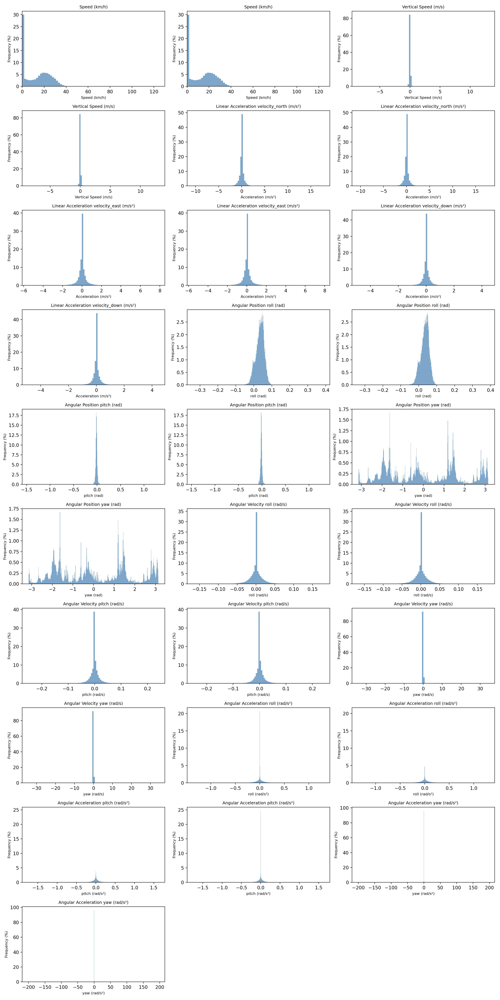
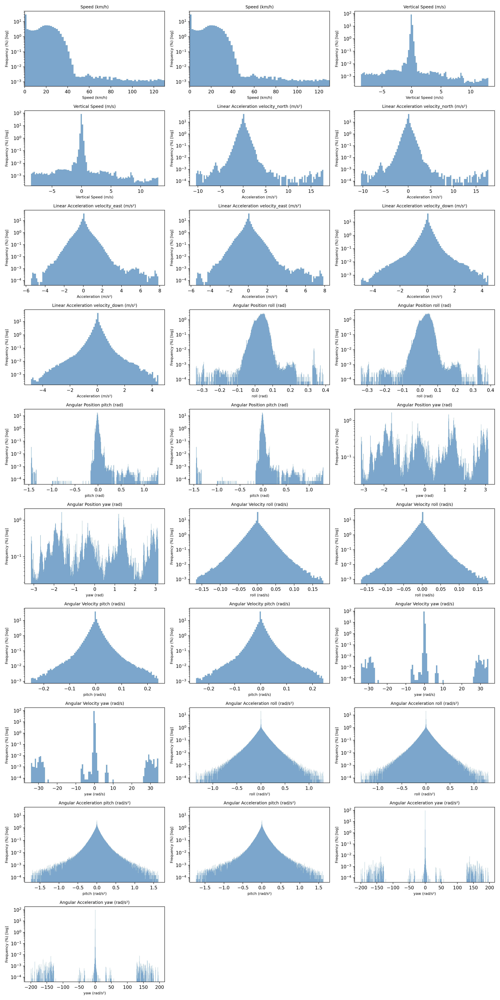

# need4Tilt
Simulation to evaluate the impact of tilting vs non tilting narrow track vehicle on trips

# Setup instructions

 It is recommended to run this project inside a dedicated Python virtual environment to keep dependencies isolated.

 On Linux or macOS, you can create and activate a virtual environment using:

 ```bash
 python3 -m venv venv
 source venv/bin/activate
 ```

 Then install all required dependencies:

 ```bash
 pip install -r requirements.txt
 ```

If you are using an IDE such as PyCharm or VS Code, you can alternatively create and select the virtual environment through the IDE’s interface — most IDEs automatically detect the `requirements.txt` file and offer to install the dependencies for you.

the python script are in the OpenStreeMapAnalysis and traceAnalysis folder. they will regenerate the plot you see.

# Result

for detailled result, look at the plot in the folder here is the summary in log + normal scale






you can also use your browser to display traceAnalysis/plots/trace_map.html

